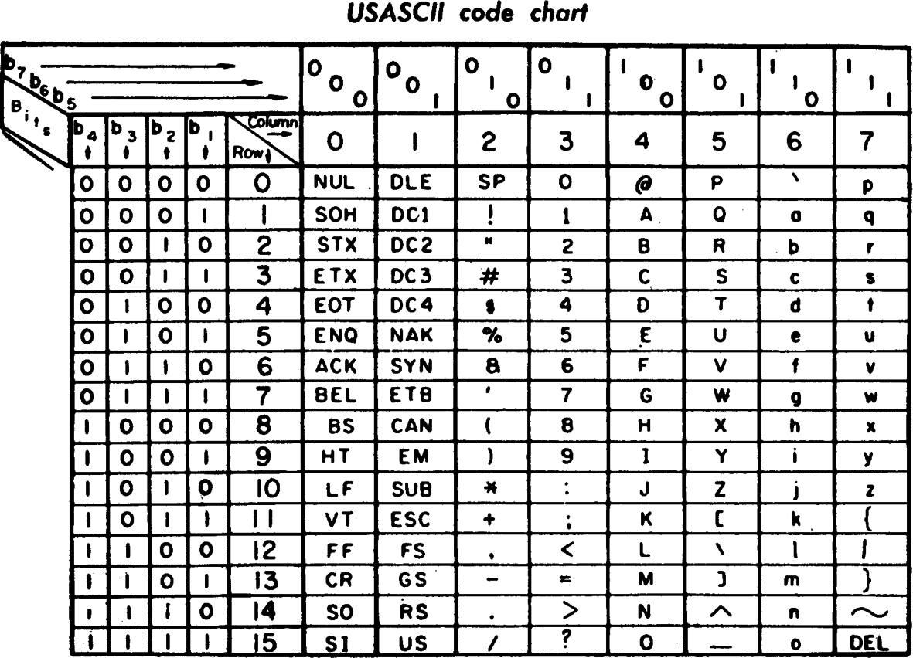

# Workshop: Introdução ao LaTeX (working title)

- Quem eu sou
- Conteúdo do curso
- Público-alvo
- Objetivos: não é ensinar todos os mínimos detalhes técnicos do LaTeX, mas
- focar em sua utilização. Ou seja, ao invés de ficar pensando em detalhes
- primeiro, vamos fazer exercícios! Também vamos aprender muita tipografia
    nessa aventura.

## História e filosofia

(Ideias: 

- vídeo do algorítimo de tipografia
- filosofia
- história do TAoCP
- )

Com o advento dos computadores, não demorou para que livros, artigos e outros
documentos começassem a ser editados digitalmente (TODO: pesquisar história da
tipografia digital). Acontece que a tabela ANSII nunca foi pensada com a
tradição tipográfica em mente, mas sim levando em conta as limitações dos
sistemas computacionais.

## O básico de LaTeX

O LaTeX é uma linguagem de marcação de texto, como o HTML ou o Markdown. Isso
significa que você deve dizer ao computador como o texto deve ser formatado,
mas quem faz o trabalho sujo não é você. O LaTeX é bastante *semântico*, mais
do que as linguagens anteriores. O que o comando a seguir deve fazer?

    \section{Introdução}

Em geral, os comandos que utilizaremos em LaTeX começam com uma barra ` \ `,
seguida pelo nome do comando. Comandos podem ter argumentos, como no caso
acima.

## hello-world.tex

Vamos abrir o arquivo `hello-world.tex` e aprender como documentos são
organizados no LaTeX. Tudo o que está entre `\begin{document}` e
`\end{document}` será impresso pelo LaTeX. O que vem antes dessa parte é
conhecido como preâmbulo. O preâmbulo deste documento é apenas
`\documentclass{article}`. Perguntar o que o público acredita que este
comandos significa.

Agora, vamos compilar nosso documento. Utilizaremos o comando `lualatex`, que
é apenas uma das maneiras de compilar um documento utilizando o LaTeX. Também
quero demonstrar outros métodos (online, por exemplo). A escolha do `lualatex`
é justificada porque esse é o método moderno de compilar LaTeX, uma vez que
ele suporta fontes OpenType e Unicode.

O que acontece se eu adicionar o comando `\section{Introdução}` antes do
texto?

Agora, vamos mudar a classe do nosso documento para `minimal`. O que isso
significa? Quais classes existem além de `article` e `minimal`? O que acontece
com `\section` quando eu mudo para a classe `minimal`?

Perguntar, aliás, o que são aquelas linhas que começam com `%` no topo do
arquivo, e por que não são impressas no documento final?

### Exercício

Compilar o arquivo hello-world.tex com sucesso.

## espaco-branco.tex

Aqui temos dois parágrafos do começo de _O guia do mochileiro das galáxias._

Mostrar o espaço em branco que existe para o público. Perguntar o que eles
esperam que aconteça quando eu compilar o documento.

Múltiplos espaços em branco no LaTeX são ignorados: apenas um espaço em branco
é colocado entre as palavras. Assim, é difícil errar e acabar com espaçamento
a mais. Essa é apenas uma das milhares de maneiras nas quais o LaTeX é
inteligente. 

Para criar um novo parágrafo, devemos deixar um espaço em branco entre as
linhas. Novas linhas são ignoradas: para inserir uma linha, `\newline` ou `\\`.

### Exercício 

`espaco-branco-exercicio.tex`. Arrumar o arquivo, deixando os
espaços e parágrafos corretos.

Notar que nem tudo funcionará perfeitamente. Qual problemas encontramos? Sim,
os diacríticos não apareceram corretamente. Alguém saberia o motivo?

## poliglota-exercicio.tex

Ao compilar o documento `espaco-branco.tex`, nós vemos que muitos caracteres
como o “é” de “além” não foram impressos. Isso acontece porque o LaTeX, nas
configurações mais básicas, não suporta diacríticos e outros símbolos.
Precisamos carregar nosso primeiro *pacote* para resolver isso.

Existem várias coisas que não são possíveis com o LaTeX básico — ao menos não
trivialmente — mas durante sua vida como usuário desse sistema você descobrirá
dezenas de pacotes muito úteis, que tornam tarefas tediosas e difíceis muito
mais agradáveis de resolver. Para carregar um pacote, usamos a seguinte
sintaxe no *preâmbulo* do nosso arquivo:

    \usepackage[opções]{pacote}

Para resolver o problema de diacríticos faltando em nosso documento,
utilizaremos o pacote `polyglossia`. Ele é uma alternativa para o antigo
pacote `babel` que funciona melhor com o luaLaTeX. Algumas das capacidades do
`polyglossia` são:

- ajustar calendário datas de acordo com a língua
- ajustar convenções tipográficas para a língua escolhida
- hifenização
- strings do documento (como em `\today`)

Para carregar as configurações para o nosso idioma, devemos usar o comando:

    \setdefaultlanguage{brazil}

### Exercício

Adicionar o pacote `polyglossia` abaixo do `\documentclass` e compilar o
arquivo.

Quando o exercício terminar, **mostrar o CTAN e como encontrar documentação
para os pacotes.** Mostrar a documentação do `polyglossia` como exemplo.

## artigo-exercicio.tex

Agora, vamos olhar para um documento um pouco mais complexo, mas também mais
típico. `artigo-exemplo.tex` demonstra alguns conceitos interessantes em LaTeX.
Vamos começar pela organização de um aquivo `.tex`. Basicamente, ele é dividido
em um *preâmbulo* no qual estão os pacotes e opções que utilizaremos e o
*documento em si,* que começa a partir do comando `\begin{document}`.

### Preâmbulo: classes e suas opções

Vamos explorar o preâmbulo para começar. A primeira linha que chama nossa atenção é:

    \documentclass[11pt,a4paper,oneside]{article}

Anteriormente discutimos duas classes LaTeX: `article` e `minimal`. Mas existem
muitas outras classes. Por exemplo:

- `article`: para escrever artigos
- `report`: para escrever relatórios
- `book`: para livros
- `letter`: para redigir letras
- `memoir`: baseada na classe book, traz vários comandos úteis
- `beamer`: para apresentações de slide

O que são essas palavras entre os dois colchetes? São opções que a classe
`article` nos fornece por padrão. É bastante útil conhecer quais são as opções
da classe que você decidiu utilizar. O que a primeira opção, `11pt` deve
significar? Repetir para todas elas e explicar seus resultados. Aqui estão as
opções de classe mais comuns:

- `10pt, 11pt, 12pt`
- `a4paper, letterpaper, ...`
- `fleqn`: equações são alinhadas à esquerda ao invés de seres centralizadas.
- `leqno`: a numeração das equações fica à esquerda ao invés da direita.
- `titlepage, notitlepage`
- `twocolumn`
- `twoside, oneside`: arruma as margens para a impressão nos dois lados do
  papel ou apenas um.
- `landscape`: o documento é impresso em formato paisagem.
- `openright, openany`: não funciona com a classe `article`, pois ela não
  fornece o comando `chapter`.
- `draft`: indica problemas de hifenização e justificação imprimindo um pequeno
  quadrado na margem direita. Também suprime a colocação das imagens, colocando
  um quadro em branco em seu lugar. O tempo de compilação é bem menor.

**Compilar o mesmo documento com várias opções diferentes e mostrar os
resultados.**

### Preâmbulo: pacotes e comandos para o título

Após o `\documentclass`, três pacotes são carregados: `polyglossia, blindtext`
e `hyperref`. Olhando o código-fonte, o que os dois últimos pacotes devem
fazer? **Mudar o conteúdo do comando `\author` para o seguinte:**

    \author{Rafael Beraldo \\[1cm]
    \href{mailto:rberaldo@cabaladada.org}{\textless rberaldo@cabaladada.org \textgreater}

O que será impresso agora?

Agora, vamos adicionar o pacote `microtype` e ver quais diferenças encontramos.
Explicar que o `microtype` mexe nos espaços entre as palavras, lida com a
protusão de caracteres perto da margem direita, bem como cuida da expansão de
fontes.

**Mostrar [o manual do
`microtype`](http://mirrors.ctan.org/macros/latex/contrib/microtype/microtype.pdf),
que tem exemplos de suas funcionalidades.**

### O documento em si

No corpo do documento, entre `\begin{document}` e `\end{document}` existem
vários comandos interessantes. **Discutir o significado de `\frenchspacing` e
ensinar também o comando `\subsection`.**

### Compilação e arquivos auxiliares

**Compilar o arquivo e mostrar a quantidade de arquivos que foram produzidos.**
A quantidade de arquivos produzidos é sempre muito grande, mas a maior parte
pode ser deletada sem problemas.

Compiladores LaTeX passam apenas uma vez pelo documento, produzindo o PDF
durante a compilação. Mas eles não pulam por todo o código, portanto certas
operações introduzem outros arquivos que guardam informações que serão usadas
mais tarde. Aqui vai uma lista de arquivos auxiliares:
https://en.wikibooks.org/wiki/LaTeX/Basics#Ancillary_files

Para evitar que tantos arquivos sejam mantidos, podemos utilizar o comando
`latexmk -c`. 

### Exercício

Transformar o arquivo `artigo-exercicio.tex` em um arquivo LaTeX e compilá-lo.
Mostrar o arquivo resolvido na tela de discutir, primeiro, como implementá-lo
com a plateia.

## fontes.tex

Originalmente, o TeX foi projetado para utilizar o sistema MetaFont, também
projetado pelo Prof. Donald Knuth. Os sistemas mais populares atualmente são,
porém, o Truetype `(ttf)` e OpenType `(otf)`. Antes de aprender a trabalhar com
fontes, seus estilos e tamanhos, gostaria de contar rapidamente a história das
fontes no TeX.

### Fontes e codificação no início do TeX

Mesmo para o olhar leigo, a tabela ASCII deve parecer terrivelmente incompleta.
Dos 128 caracteres possíveis (2^7), apenas 95 são imprimíveis, e não há uma
letra sequer que seja acentuada. Quando o Prof. Donald Knuth criou a primeira
codificação das fontes do TeX, conhecida como `OT1` (Old Text 1), ela também
contava com apenas 7 bits, com a maioria dos caracteres advindos da tabela
ASCII. Naquela época, se o usuário desejasse inserir uma palavra com acentos,
era necessário escrever o seguinte:

    Eur\'{i}pides

O TeX sobrepunha os acentos às letras, conseguindo um resultado visualmente
perfeito. Essa técnica ainda é usada por usuários de LaTeX para quem os
caracteres inclusos na ASCII são suficientes. Ela não vem sem seus problemas,
como:

- Palavras acentuadas não são hifenizadas.
- Não é possível buscar palavras acentuadas no output — muito menos
  copiá-las.
- Não é possível representar outros sistemas de escrita — como o alfabeto
  cirílico, o sistema de escrita árabe, caracteres chineses etc.

Em 1990, no Encontro Anual Geral do TUG (TeX User Group) em Cork, Irlanda, um
grupo de usuários especificou uma codificação com 256 glifos que cobriam a
maior parte das línguas do Oeste da Europa, bem como algumas línguas do Leste.
Essa codificação ficou conhecida como `T1`.

Quando comecei a aprender LaTeX, a recomendação era utilizar os seguintes
pacotes no preâmbulo para escrever textos em português:

    \usepackage[utf8]{inputenc}
    \usepackage[T1]{fontenc}

Felizmente, hoje existe uma solução mais simples e abrangente.

### UTF-8, UTF-16, UTF-32, Unicode, WTF?

O Unicode é um padrão que começou no fim da década de 1980 e hoje tem mais de
120 000 caracteres. O objetivo é codificar a maior parte dos sistemas de
escrita do mundo, bem como outros símbolos.

O Unicode é, no fundo, uma tabela que dá endereços aos caracteres. O trabalho
fica, geralmente, para o UTF-8 — que pode usar até 4 bytes para representar
qualquer caractere Unicode, e é mais comumente usado porque é compatível com a
tabela ASCII. Outras codificações, como o UTF-16 (que divide o espaço do
Unicode em duas sequências de 16 bits) ou o UTF-32.

O pacote sobre o qual aprendemos mais no começo deste workshop, `polyglossia`,
carrega um outro pacote chamado `fontspec`, sobre o qual falaremos agora. Por
motivos de clareza, incluiremos uma chamada a esse pacote a partir de agora em
nosso código. Antes de revelarmos a mágica, aprenderemos um pouco sobre a
história de como chegamos a ele.

Para carregar o pacote `fontspec`, basta adicionar o comando
`\usepackage{fontspec}` ao preâmbulo do documento. A codificação utilizada,
automaticamente, é a `TU`: TeX Unicode. Aprenderemos mais sobre esse pacote no
decorrer desse exercício.

### Itálicos, negritos e outros tipos

Fontes geralmente vêm em famílias que contém diversos tipos: romanas maiúsculas
e minúsculas, itálicos, negritos e versaletes, além dos algorismos de título e
texto. A fonte usada por padrão no LaTeX, chamada de Computer Modern e
projetada pelo próprio Knuth, é bastante completa nesse respeito. Para acessar
esses tipos, temos os comandos a seguir à nossa disposição.

- `\emph{}`: itálico quando em texto romano, romando quando em texto itálico
- `\textbf{}`: negrito
- `\textsc{}`: versaletes (em inglês: *small caps*)
- `\texttt{}`: fonte de teletipo

### Tamanhos

Assim como diferentes tipos carregam diferentes significados, os tamanhos das
fontes também devem revelar alguma intenção semântica. Os tamanhos também devem
ter alguma relação entre si: uma escala.

O LaTeX leva essas questões em consideração automaticamente quando usamos
comandos como `\section`, por exemplo. Nós também podemos acessar esses
tamanhos utilizando os seguintes comandos:

- `\tiny`: 5pt
- `\scriptsize`: 7pt
- `\footnotesize`: 8pt
- `\small`: 9pt
- `\normalsize`: 10pt
- `\large`: 12pt
- `\Large`: 14pt
- `\LARGE`: 17pt
- `\huge`: 20pt
- `\Huge`: 25pt

Tenha em mente que os valores acima valem apenas para as classes quem vem por
padrão no LaTeX e quando o valor de `normalsize` é igual a 10pt. Outras classes
podem trazer outros valores, de acordo com a decisão de seu designer. Além
disso, é importante dizer que o tamanho do ponto no TeX é diferente do tamanho
usado atualmente pela maior parte dos programas. Quando Knuth projetou o
sistema, a editoração digital não era comum e muito menos acessível. Durante a
infância em Milwaukee, Wisconsin, seu pai era dono de uma editora. Assim, Knuth
cresceu dentro da tradição anglo-saxã de tipografia, que define um ponto como
0.35145980 mm. No entanto, com o advento do PostScript da Adobe, o ponto foi
redefinido para 0.3527 mm (1/72 in).

### Selecionar fontes diferentes

Uma das maiores vantagens de utilizar o `fontspec` é o comando de seleção de
fontes. Antigamente, era necessário carregar um pacote que implementasse a
fonte desejada em MetaFont. Hoje, é possível usar arquivos `ttf` e `otf`.

Para selecionar uma fonte instalada no sistema nos diretórios padrões, basta
usar o comando: 

    \setmainfont{Linux Libertine}

Caso você esteja trabalhando com um dos editores online de LaTeX, é possível
fazer o upload das fontes para o serviço e especificar o caminho. Por exemplo:

    \setmainfont{Linux Libertine}[
      Path = fonts/
    ]

Uma funcionalidade muitas vezes ignorada sobre as fontes são as ligaduras. Elas
acontecem em sequências de caracteres que colidem naturalmente e são uma
tradição tipográfica muito antiga, que ganhamos de graça usando o LaTeX.

### Exercício

Vamos resolver `fontes-exercicio.tex`.

## layouts-pagina.tex

Usando a solução do exercício anterior, vamos mudar a opção de classe
`onecolumn` para `twocolumn` e visualizar o efeito dessa mudança no layout da
página. Também carregaremos o pacote `showframe`. **Mostrar como as margens são
muito maiores.** Parece uma perda de papel — e é — mas existe um motivo por
trás de margens são grandes: quando lemos uma linha longa demais, perdemos a
noção de onde ela havia começado. O tamanho de linha ideal fica por volta de 66
caracteres, incluindo espaços. É por isso que jornais são divididos em tantas
colunas. Para resolver esse problema das margens, existem algumas soluções:

- Dividir o texto em duas colunas (melhor solução)
- Carregar o pacote `fullpage`
- Carregar o pacote `fullpage` com espaçamento grande entre as linhas (como
  exige a ABNT).

Para arrumar o espaçamento entre as linhas, devemos utilizar o pacote
`setspace`. Ele vem com os seguintes comandos:

- `\singlespacing`
- `\onehalfspacing`
- `\doublespacing`

Quando você utilizar o comando `\onehalfspacing`, por exemplo, o documento
seguirá esse espaçamento até que outro espaçamento seja especificado.

Outro fator que influencia o layout da página é seu estilo. O LaTeX vem com
dois comandos, `\pagestyle{}` e `\thispagestyle{}`, que aceitam os seguintes
argumentos:

- `empty`: sem texto no cabeçalho e no rodapé
- `plain`: cabeçalho limpo, mas o número da página aparece centralizado no
  rodapé
- `headings`: rodapé limpo, informações como o nome da seção e número da página
  aparecem no cabeçalho

Existem outras opções e comandos que nos permitem customizar o conteúdo do
cabeçalho e do rodapé, mas não trataremos deles nesse workshop.

## Exercício

Em `layout-pagina-exercicio.tex`, vamos começar a escrever um certificado de
conclusão do workshop. No momento, não vamos nos preocupar com a posição exata
do texto no papel. Algumas ideias de como implementar:

- Um certificado em modo de paisagem é muito mais legal
- Quais seriam os tamanhos dos diferentes textos? Qual a relação hierárquica
  entre eles? Justifique sua decisão.

A ideia para este exercício foi tirada do livro *LaTeX Tutorials: a Primer*.

## posicao-texto.tex

Se quisermos que nosso certificado fique mais parecido com o slide anterior,
precisamos aprender a colocar nosso texto nas regiões do papel que desejamos.
Por padrão, as caixas de texto em LaTeX são justificadas, mas há outras opções
comuns como textos centralizados, alinhados à esquerda ou à direita.

Para determinar a posição horizontal do texto, precisamos encontrar nosso
primeiro *ambiente.* Na verdade, um dos primeiros construtos que encontramos em
nossa jornada foi o ambiente `document`, delimitado por dois comandos: `\begin`
e `\end`.

O ambiente `center`, com o nome sugere, se encarrega de centralizar texto na
página:

    \begin{center}
      Este texto será centralizado.
    \end{center}

De maneira similar, os ambiente `flushleft` e `flushright` alinham texto ao
lado esquerdo e direito do papel, respectivamente.

Além disso, é possível controlar o espaço dentro de uma linha com o comando
`\hspace{comprimento}`, por exemplo:

    Essa frase\hspace{1.5cm} está esticada.

Algumas unidades que o LaTeX reconhece são:

- `mm`
- `cm`
- `in`
- `pt`
- `em` (comprimento da letra “m”)
- `ex` (altura da letra “x”)
- `\textheight` e `\textwidth` (altura e comprimento da corpo do texto)
- `\pageheight` e `\pagewidth` (altura e comprimento da página toda)

Ainda é possível utilizar o comando `\hfill`, que preenche todo o espaço
disponível na linha:

    Começo\hfill meio\hfill fim

Finalmente, o espaço vertical entre os parágrafos pode ser controlado da mesma
maneira, com os comandos `\vspace{comprimento}` e `\vfill`.

### Exercício

`posicao-texto-exercicio.tex` continua o exercício anterior, finalizando nosso
certificado.

## ABNTeX2

TODO: Ensinar como usar o pacote ABNTeX2.

## Referências

- [Post no reddit sobre a tipografia do TAoCP antes do TeX]
  (https://www.reddit.com/r/compsci/comments/2ksmde/what_did_the_art_of_computer_programming_look/)
- [Guia do Wikibooks](https://en.wikibooks.org/wiki/LaTeX)
- [História da codificação de
  fontes](ftp://ftp.dante.de/tex-archive/macros/latex/doc/encguide.pdf)
- [LaTeX Tutorials: a
- Primer](https://www.tug.org/twg/mactex/tutorials/ltxprimer-1.0.pdf)
